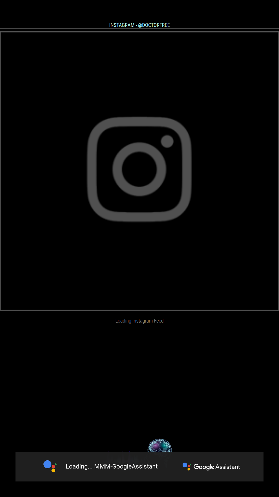
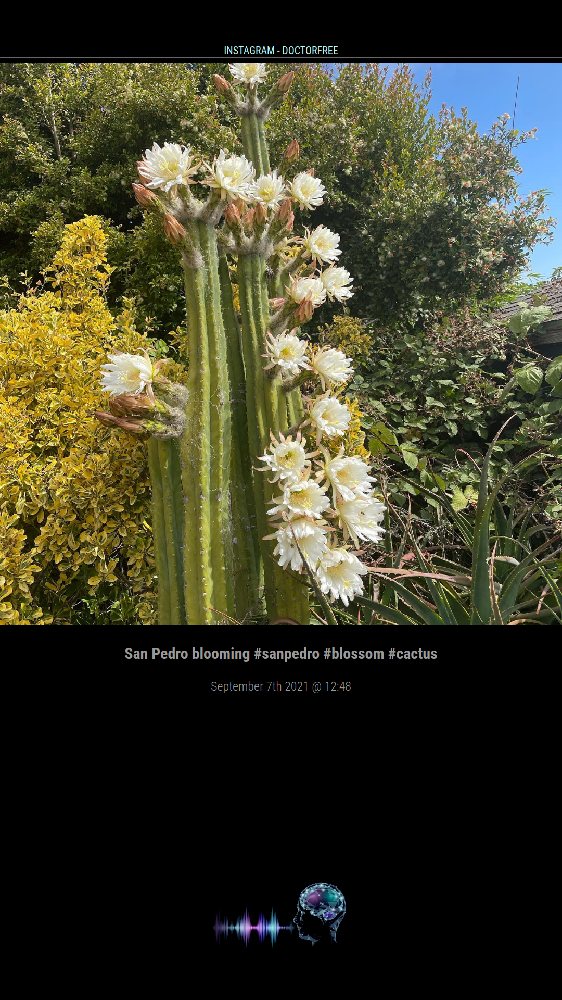
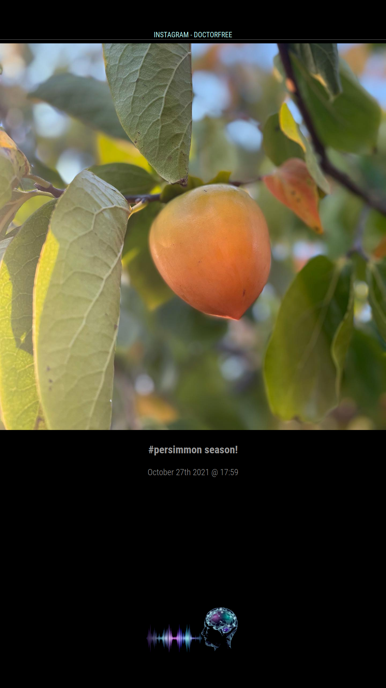

## MMM-InstagramView
This is a module for the
[MagicMirror](https://github.com/MichMich/MagicMirror/tree/develop)
for displaying your Instagram photos, videos, carousel albums, and comments
on your MagicMirror. It makes use of the Facebook Instagram Graph API.

<p float="left">
Module loading image and example display of Instagram posting<br/>
(click to enlarge)<br/>
  
  
</p>

## Table of Contents

1. [Prerequisites](#prerequisites)
1. [Installing](#installing)
1. [Configuration](#configuration)
    1. [Example config entry](#example-config-entry)
1. [Authorization Process](#authorization-process)
1. [License](#license)
1. [Acknowledgments](#acknowledgments)

## Prerequisites
This module requires a Facebook Developer App in "Development" mode. 
[This Getting Started guide](https://developers.facebook.com/docs/instagram-basic-display-api/getting-started) from Facebook will show you how to setup the App for instagram access.
```diff
- Just follow steps 1, 2 and 3 to get the variables you need.
```
```diff
+ Note: For the Callback URL's required, namely:
+ "Valid OAuth Redirect URIs"
+ "Deauthorize Callback URL"
+ "Data Deletion Request Callback URL"
+ You can just use: https://localhost/
```
From the app settings you will need:
1. client_id
2. client_secret
3. redirect_uri

## Installing
1. Navigate to the `modules` folder and execute `git clone https://github.com/doctorfree/MMM-InstagramView.git`. A new folder with the name 'MMM-InstagramView will be created, navigate into it.
2. Execute `npm install` to install the node dependencies.
3. Configure as per below.
4. Follow the Authorization Process.

## Configuration

|Option|Description|
|---|---|
|`client_id`|Facebook Instagram App ID required for the Facebook Instagram APP. <br><br>**Type:** `string`<br>This value is **REQUIRED**|
|`client_secret`|Client Secret required for the Facebook Instagram APP.<br><br>**Type:** `string`<br>This value is **REQUIRED**|
|`redirect_uri`|OAuth Redirect URIs required for the Facebook Instagram APP.<br><br>**Type:** `string`<br>This value is **REQUIRED**|
|`auth_code`|Used to input a temporary authorization code as part of the authorization process<br><br>**Type:** `string`|
|`showComments`|Show post description.<br><br>**Type:** `boolean`|
|`showControls`|Show video playback controls.<br><br>**Type:** `boolean`|
|`showDate`|Show date and time of post.<br><br>**Type:** `boolean`|
|`showMediaType`|Show media type.<br><br>**Type:** `boolean`|
|`animationSpeed`|How long for the animation to last when moving to the next image.<br><br>**Type:** `integer`|
|`updateInterval`|How long before refreshing image.<br><br>**Type:** `integer`|

### Example config entry

```javascript
{
  module: 'MMM-InstagramView',
  position: 'top_center',
  header: 'MMM-InstagramView',
  config: {
    client_id: '<YOUR FACBOOK INSTAGRAM APP ID>', // Facebook Instagram App ID
    client_secret: '<YOUR FACBOOK INSTAGRAM APP SECRET>', // Facebook Instagram App Secret
    redirect_uri: '<YOUR FACEBOOK INSTAGRAM APP REDIRECT URL', // Facebook Instagram App redirect_uri
    auth_code: '', // Temporary authorization code as part of the Facebook Instagram Authorization Process
    showComments: true,
    showDate: true,
    showMediaType: false,
    animationSpeed: 5000,
    updateInterval: 60000,
  }
}
```

## Authorization Process
1. Ensure that client_id, client_secret and redirect_uri are all configured in config.js and that they match your settings in the Facebook Develloper App.
2. Ensure the auth_code configuration varibale is set to nothing or ''.
3. Ensure the `accesstoken.cfg` file does not contain an access token and is completely blank.
4. Start MagicMirror and wait for the authorization link to show, you will need to either VNC into your MagicMirror or access the MagicMirror interface remotely 'http://magic_mirror_ip:8080/'
5. Look for the Message defined below and click the "Here" link

<p float="left">
Authorization Process Step 4<br/>
  
</p>

```diff
+ Note: The mouse pointer may be hidden, just right-click to locate your pointer.
```

6. Click the Authorize Button and the form will send you to your redirect_uri and give you an auth_code in the url.

<p float="left">
Authorization Process Step 5<br/>
  
</p>

DONT PANIC! If the url contains a string like ?code=ABCDE...........123SDG0129#_ all is good.

<p float="left">
Authorization Process Step 6<br/>
  
</p>

7. Copy the auth_code from the url, removing the `#_` at the end
```
?code= <<<auth_code>>> #_
```
8. Add the auth_code to your config.js file.
9. Restart MagicMirror and enjoy your instagram feed.

<p float="left">
After Authorization Process is Complete<br/>
(click to enlarge)<br/>
  
</p>

**Note:** The authorization process uses a key stored in `accesstoken.cfg`
under the module directory. This allows access to the account for 60 days.
There is a mechanism in place to renew the key every time MagicMirror is restarted.
If the access token expires, just repeat the authorization process.

## License
This project is licensed under the MIT License - see the [LICENSE.md](LICENSE.md) file for details

## Acknowledgments
* [Alexander Salter](https://github.com/AlexanderSalter) for creating the [MMM-Instagram2020](https://github.com/AlexanderSalter/MMM-Instagram2020) module used as the primary guidance in creating this module.
* [Dimitrios Kapsalis](https://github.com/kapsolas) for creating the original [MMM-Instagram](https://github.com/kapsolas/MMM-Instagram) module that was used as guidance in creating the MMM-Instagram2020 module.
