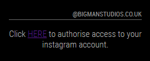
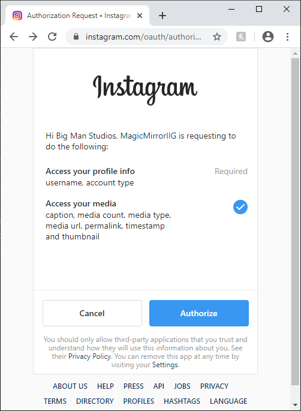
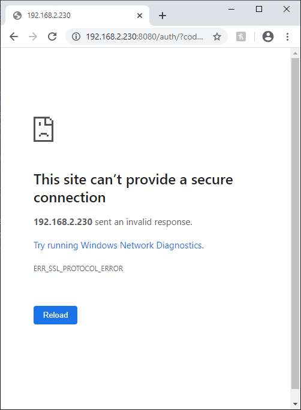

## MMM-InstagramView
This is a module for the
[MagicMirror](https://github.com/MichMich/MagicMirror/tree/develop)
for displaying your Instagram photos, videos, carousel albums, and comments
on your MagicMirror. It makes use of the Facebook Instagram Graph API.

<p float="left">
Module loading image and example display of Instagram posting<br/>
(click to enlarge)<br/>
  
  
</p>

**Note:** This module is compatible with
[MMM-GoogleAssistant](http://wiki.bugsounet.fr/en/MMM-GoogleAssistant),
unlike previous Instagram modules<br/>

## Table of Contents

1. [Prerequisites](#prerequisites)
1. [Installing](#installing)
    1. [Updates](#updates)
1. [Configuration](#configuration)
    1. [Example config entry](#example-config-entry)
    1. [CSS Styling](#css-styling)
1. [Authorization Process](#authorization-process)
1. [Features](#features)
1. [Support](#support)
1. [License](#license)
1. [Acknowledgments](#acknowledgments)

## Prerequisites
This module requires a Facebook Developer App in "Development" mode. 
[This Getting Started guide](https://developers.facebook.com/docs/instagram-basic-display-api/getting-started) from Facebook will show you how to setup the App for instagram access.
```diff
- Just follow steps 1, 2 and 3 to get the variables you need.
```
```diff
+ Note: For the Callback URL's required, namely:
+ "Valid OAuth Redirect URIs"
+ "Deauthorize Callback URL"
+ "Data Deletion Request Callback URL"
+ You can just use: https://localhost/
```
From the app settings you will need:
1. client_id
2. client_secret
3. redirect_uri

## Installing
1. Navigate to the `modules` folder and execute `git clone https://github.com/doctorfree/MMM-InstagramView.git`. A new folder with the name 'MMM-InstagramView will be created, navigate into it.
2. Execute `npm install` to install the node dependencies.
3. Configure as per below.
4. Follow the Authorization Process.

### Updates
Update this module by navigating into its folder on the command line
and executing the commands:

- `git pull`
- `npm install`

```bash
cd ~/MagicMirror/modules/MMM-InstagramView # adapt directory if you are using a different one
git pull
npm install # install (new) dependencies
```

## Configuration

|Option|Description|
|---|---|
|`client_id`|Facebook Instagram App ID required for the Facebook Instagram APP. <br><br>**Type:** `string`<br>This value is **REQUIRED**|
|`client_secret`|Client Secret required for the Facebook Instagram APP.<br><br>**Type:** `string`<br>This value is **REQUIRED**|
|`redirect_uri`|OAuth Redirect URIs required for the Facebook Instagram APP.<br><br>**Type:** `string`<br>This value is **REQUIRED**|
|`auth_code`|Used to input a temporary authorization code as part of the authorization process<br><br>**Type:** `string`|
|`showComments`|Show post description.<br><br>**Type:** `boolean`|
|`showChildren`|Show all media in post (Carousel Albums).<br><br>**Type:** `boolean`|
|`showDate`|Show date and time of post.<br><br>**Type:** `boolean`|
|`showMediaType`|Show media type.<br><br>**Type:** `boolean`|
|`animationSpeed`|How long for the animation to last when moving to the next image.<br><br>**Type:** `integer`|
|`updateInterval`|How long before refreshing image.<br><br>**Type:** `integer`|

### Example config entry

```javascript
{
  module: 'MMM-InstagramView',
  position: 'top_center',
  header: 'Instagram - @doctorfree',
  config: {
    client_id: '<YOUR FACBOOK INSTAGRAM APP ID>', // Facebook Instagram App ID
    client_secret: '<YOUR FACBOOK INSTAGRAM APP SECRET>', // Facebook Instagram App Secret
    redirect_uri: '<YOUR FACEBOOK INSTAGRAM APP REDIRECT URL', // Facebook Instagram App redirect_uri
    auth_code: '', // Temporary authorization code as part of the Facebook Instagram Authorization Process
    showComments: true,
    showChildren: true,
    showDate: true,
    showMediaType: false,
    animationSpeed: 5000,
    updateInterval: 60000,
  }
}
```

### CSS Styling

The default styling applied to the MMM-InstagramView module is as follows:

```css
.image {
  margin-right: 15px;
}

.green {
  color: #83FFB3;
}

.yellow {
  color: yellow;
}

.red {
  color: #FF4C4C;
}

#MMM-Instagram-image {
  width:1080px;
}

#MMM-Instagram-video {
  width:1080px;
}
```

Additional custom styling may be applied with entries in:

```console
MagicMirror/css/custom.css
```

For example, to increase the font size of the module header,
add the following to your custom.css file:

```css
.MMM-InstagramView .module-header {
  font-size: 40px;
}
```

## Authorization Process
1. Ensure that client_id, client_secret and redirect_uri are all configured in config.js and that they match your settings in the Facebook Develloper App.
2. Ensure the auth_code configuration varibale is set to nothing or ''.
3. Ensure the `accesstoken.cfg` file does not contain an access token and is completely blank.
4. Start MagicMirror and wait for the authorization link to show, you will need to either VNC into your MagicMirror or access the MagicMirror interface remotely 'http://magic_mirror_ip:8080/'
5. Look for the Message defined below and click the "Here" link

<p float="left">
Authorization Process Step 4<br/>
  
</p>

```diff
+ Note: The mouse pointer may be hidden, just right-click to locate your pointer.
```

6. Click the Authorize Button and the form will send you to your redirect_uri and give you an auth_code in the url.

<p float="left">
Authorization Process Step 5<br/>
  
</p>

DONT PANIC! If the url contains a string like ?code=ABCDE...........123SDG0129#_ all is good.

<p float="left">
Authorization Process Step 6<br/>
  
</p>

7. Copy the auth_code from the url, removing the `#_` at the end
```
?code= <<<auth_code>>> #_
```
8. Add the auth_code to your config.js file.
9. Restart MagicMirror and enjoy your instagram feed.

<p float="left">
After Authorization Process is Complete<br/>
(click to enlarge)<br/>
  
</p>

**Note:** The authorization process uses a key stored in `accesstoken.cfg`
under the module directory. This allows access to the account for 60 days.
There is a mechanism in place to renew the key every time MagicMirror is restarted.
If the access token expires, just repeat the authorization process.

## Features

In addition to those features available and supported in MMM-Instagram and
MMM-Instagram2020, this module supports features previously unavailable in
MagicMirror Instagram modules. Included with this version of MMM-InstagramView
are the following:

- Support for playback of Instagram video posts
- All media in multiple media Instagram posts can be displayed
    - The `showChildren` config option controls whether all media in posts are displayed
- Compatibility with MMM-GoogleAssistant and MMM-Detector
- Additional configuration options:
   - showComments: Controls whether post description is displayed
   - showChildren: Controls whether additional media in post are shown
   - showDate: Controls whether date of post is displayed
   - showMediaType: Controls whether media type is displayed
- Improved custom CSS capabilities
- Module updates no longer clobber the stored access token
- Multiple bug fixes

## Support

Issues with MMM-InstagramView can be reported and tracked in the Issues section
of the repository at https://github.com/doctorfree/MMM-InstagramView/issues

## License
This project is licensed under the MIT License.
See the [LICENSE](LICENSE) file for details.

## Acknowledgments

This module derives from the original MMM-Instagram module and its fork,
the MMM-Instagram2020 module. Thanks to the following authors of those modules.

* [Alexander Salter](https://github.com/AlexanderSalter) for creating the [MMM-Instagram2020](https://github.com/AlexanderSalter/MMM-Instagram2020) module used as the primary guidance in creating this module.
* [Dimitrios Kapsalis](https://github.com/kapsolas) for creating the original [MMM-Instagram](https://github.com/kapsolas/MMM-Instagram) module that was used as guidance in creating the MMM-Instagram2020 module.
